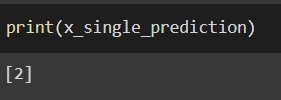

# Convolutional Deep Neural Network for Digit Classification

## AIM

To Develop a convolutional deep neural network for digit classification and to verify the response for scanned handwritten images.

## Problem Statement and Dataset

## Neural Network Model

Include the neural network model diagram.

## DESIGN STEPS

### STEP 1:
Import tensorflow and preprocessing libraries


### STEP 2:
Build a CNN model


### STEP 3:
Compile and fit the model and then predict


## PROGRAM
```
# Reg.no: 212222240076
# Name: Praveen D
```
```
import numpy as np
from tensorflow import keras
from tensorflow.keras import layers
from tensorflow.keras.datasets import mnist
import tensorflow as tf
import matplotlib.pyplot as plt
from tensorflow.keras import utils
import pandas as pd
from sklearn.metrics import classification_report,confusion_matrix
from tensorflow.keras.preprocessing import image

(X_train, y_train), (X_test, y_test) = mnist.load_data()

X_train.shape

X_test.shape

single_image=X_train[100]

single_image.shape

plt.imshow(single_image,cmap='gray')

y_train.shape

y_train[100]

X_train.min()

X_train.max()

X_train_scaled=X_train/255.0
X_test_scaled=X_test/255.00

y_train_onehot = utils.to_categorical(y_train,10)
y_test_onehot = utils.to_categorical(y_test,10)

type(y_train_onehot)

y_train_onehot.shape

single_image = X_train[500]
plt.imshow(single_image,cmap='gray')

y_train_onehot[500]

X_train_scaled = X_train_scaled.reshape(-1,28,28,1)
X_test_scaled = X_test_scaled.reshape(-1,28,28,1)

model= keras.Sequential()
model.add(layers.Input(shape=(28,28,1)))
model.add(layers.Conv2D(filters=32,kernel_size=(3,3),activation='relu'))
model.add(layers.MaxPool2D(pool_size=(2,2)))
model.add(layers.Flatten())
model.add(layers.Dense(32,activation='relu'))
model.add(layers.Dense(64,activation='relu'))
model.add(layers.Dense(10,activation='softmax'))

model.summary()

model.compile(loss='categorical_crossentropy',optimizer='adam',metrics='accuracy')

model.fit(X_train_scaled ,y_train_onehot, epochs=8,batch_size=128, validation_data=(X_test_scaled,y_test_onehot))

metrics = pd.DataFrame(model.history.history)
metrics.head()

metrics[['accuracy','val_accuracy']].plot()

metrics[['loss','val_loss']].plot()

x_test_predictions = np.argmax(model.predict(X_test_scaled), axis=1)

print(confusion_matrix(y_test,x_test_predictions))

print(classification_report(y_test,x_test_predictions))

img = image.load_img('t.jpeg')
type(img)
img = image.load_img('t.jpeg')
img_tensor = tf.convert_to_tensor(np.asarray(img))
img_28 = tf.image.resize(img_tensor,(28,28))
img_28_gray = tf.image.rgb_to_grayscale(img_28)
img_28_gray_scaled = img_28_gray.numpy()/255.0

x_single_prediction = np.argmax(model.predict(img_28_gray_scaled.reshape(1,28,28,1)),axis=1)
print(x_single_prediction)

plt.imshow(img_28_gray_scaled.reshape(28,28),cmap='gray')

img_28_gray_inverted = 255.0-img_28_gray
img_28_gray_inverted_scaled = img_28_gray_inverted.numpy()/255.0
plt.imshow(img_28_gray_inverted_scaled.reshape(28,28),cmap='gray')

x_single_prediction = np.argmax(model.predict(img_28_gray_inverted_scaled.reshape(1,28,28,1)), axis=1)

print(x_single_prediction)
```

## OUTPUT

### Training Loss, Validation Loss Vs Iteration Plot


### Classification Report


### Confusion Matrix


### New Sample Data Prediction



## RESULT
Thus a convolutional deep neural network for digit classification and to verify the response for scanned handwritten images is written and executed successfully
